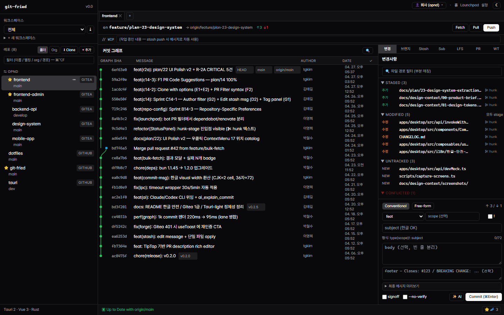
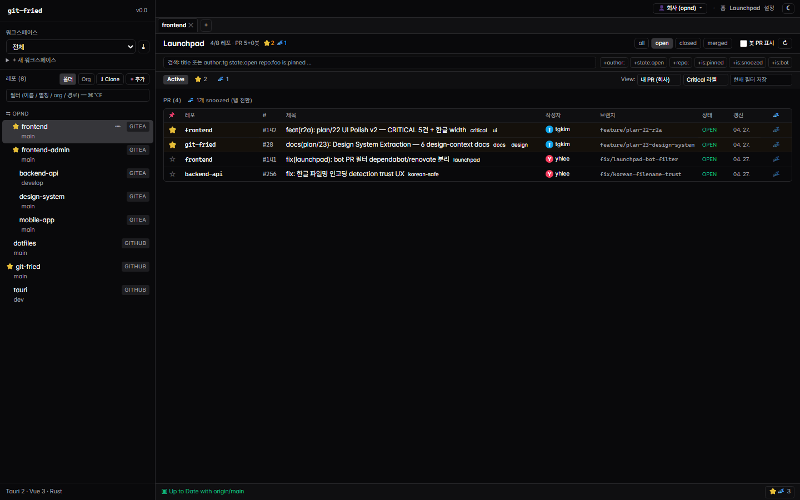
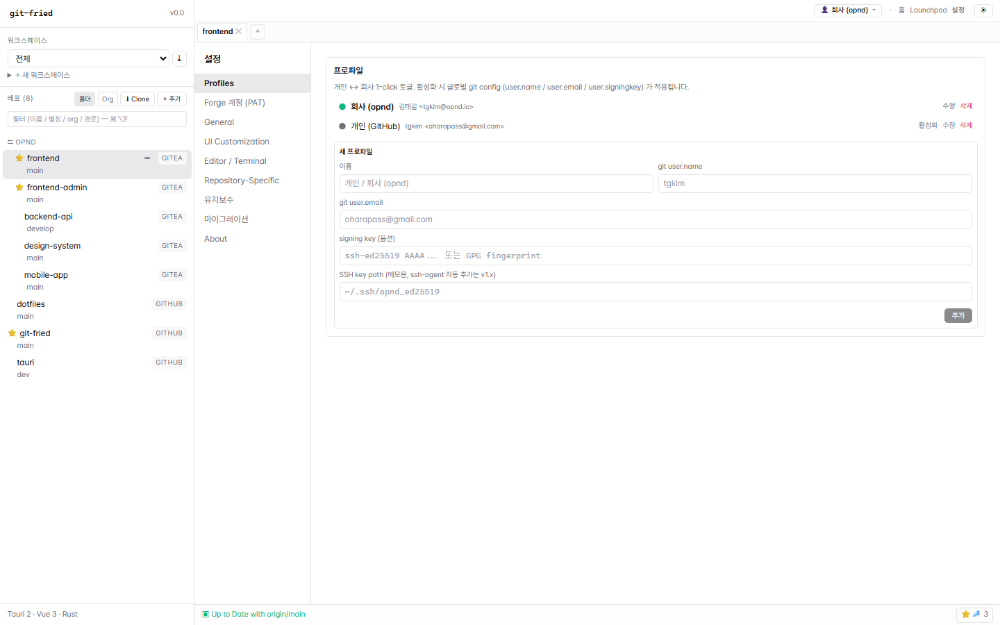
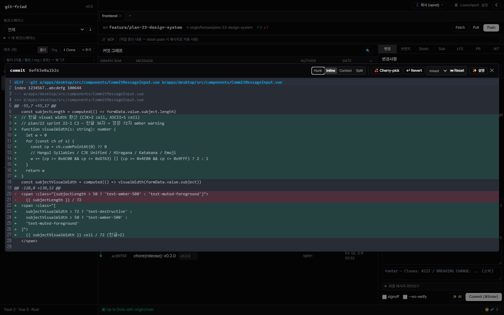
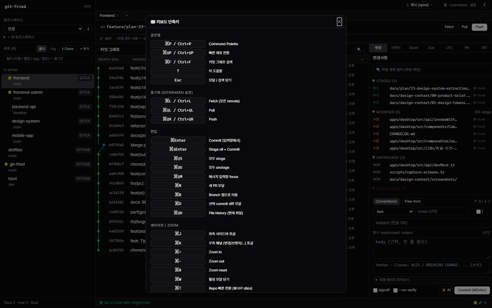
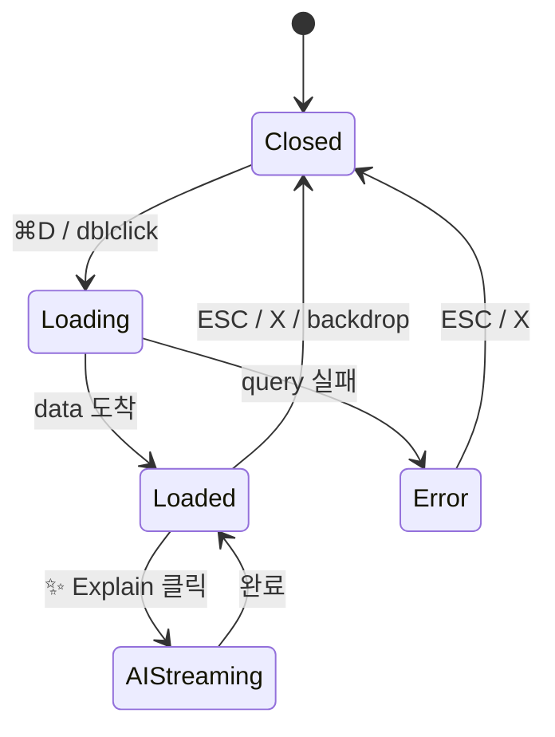
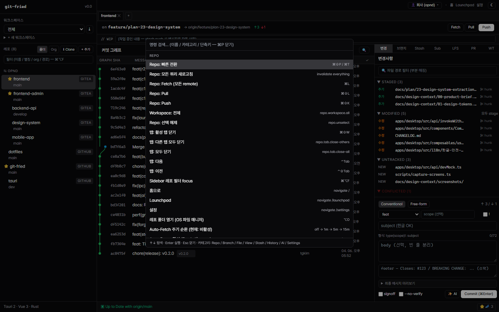

# 03. Screens & Flows — git-fried

> **이 문서의 독자**: 화면 와이어프레임 / flow diagram 그리는 디자이너.
> **출처**: Phase 1 Agent C (Explore) + plan/22 § 3·4 + Phase 3 Playwright 캡처 (12 화면).
> **범위**: 3 페이지 + 18 모달 + Command Palette + ContextMenu 17 + Click→Detail 15.

---

## 0. 스크린샷 인덱스 — 36 화면 (Playwright + IPC mock fixture)

> 1440×900 viewport. `apps/desktop/src/api/devMock.ts` 의 fixture 로 채워진 화면.
> 한글 commit / 듀얼 워크스페이스 (회사 Gitea + 개인 GitHub) / ahead-behind / conflict / 한글 파일명 등 정체성 표현.

### 0-1. 페이지 3 × light/dark (6)

| 화면 | Light | Dark |
|------|-------|------|
| **메인 워크벤치** (sidebar + CommitGraph + StatusPanel + CommitMessageInput) | [01-main-light.png](./screenshots/01-main-light.png) | [01-main-dark.png](./screenshots/01-main-dark.png) |
| **Launchpad** (PR 보드) | [02-launchpad-light.png](./screenshots/02-launchpad-light.png) | [02-launchpad-dark.png](./screenshots/02-launchpad-dark.png) |
| **Settings** (Profiles 카테고리) | [03-settings-light.png](./screenshots/03-settings-light.png) | [03-settings-dark.png](./screenshots/03-settings-dark.png) |

### 0-2. 우측 메인 탭 패널 (6)

| 패널 | 화면 |
|------|------|
| BranchPanel (⌘B) | [07-branch-panel-dark.png](./screenshots/07-branch-panel-dark.png) |
| StashPanel (⌘3) | [08-stash-panel-dark.png](./screenshots/08-stash-panel-dark.png) |
| ForgePanel → PR | [09-pr-panel-dark.png](./screenshots/09-pr-panel-dark.png) |
| SubmodulePanel | [10-submodule-panel-dark.png](./screenshots/10-submodule-panel-dark.png) |
| LfsPanel | [11-lfs-panel-dark.png](./screenshots/11-lfs-panel-dark.png) |
| WorktreePanel | [12-worktree-panel-dark.png](./screenshots/12-worktree-panel-dark.png) |

### 0-3. ForgePanel sub-tab (3)

| Sub-tab | 화면 |
|---------|------|
| Tag | [13-tag-panel-dark.png](./screenshots/13-tag-panel-dark.png) |
| Issue | [14-issue-panel-dark.png](./screenshots/14-issue-panel-dark.png) |
| Release | [15-release-panel-dark.png](./screenshots/15-release-panel-dark.png) |

### 0-4. Settings 카테고리 8 (light)

| 카테고리 | 화면 |
|---------|------|
| Forge 계정 (PAT) | [16-settings-00-forge-계정-pat-light.png](./screenshots/16-settings-00-forge-계정-pat-light.png) |
| General | [16-settings-01-general-light.png](./screenshots/16-settings-01-general-light.png) |
| UI Customization | [16-settings-02-ui-customization-light.png](./screenshots/16-settings-02-ui-customization-light.png) |
| Editor / Terminal | [16-settings-03-editor-terminal-light.png](./screenshots/16-settings-03-editor-terminal-light.png) |
| Repository-Specific | [16-settings-04-repository-specific-light.png](./screenshots/16-settings-04-repository-specific-light.png) |
| 유지보수 | [16-settings-05-유지보수-light.png](./screenshots/16-settings-05-유지보수-light.png) |
| 마이그레이션 | [16-settings-06-마이그레이션-light.png](./screenshots/16-settings-06-마이그레이션-light.png) |
| About | [16-settings-07-about-light.png](./screenshots/16-settings-07-about-light.png) |

### 0-5. Modal (13)

| 모달 | 트리거 | 화면 |
|------|--------|------|
| CommandPalette | ⌘P | [04-command-palette-dark.png](./screenshots/04-command-palette-dark.png) |
| HelpModal | ? | [05-help-modal-dark.png](./screenshots/05-help-modal-dark.png) |
| CommitDiffModal — Inline | ⌘D | [06-commit-diff-dark.png](./screenshots/06-commit-diff-dark.png) |
| CommitDiffModal — Split | ⌘D + Split tab | [32-commit-diff-split-dark.png](./screenshots/32-commit-diff-split-dark.png) |
| CreatePrModal | ⌘N | [24-create-pr-modal-dark.png](./screenshots/24-create-pr-modal-dark.png) |
| FileHistoryModal | ⌘⇧H | [25-file-history-modal-dark.png](./screenshots/25-file-history-modal-dark.png) |
| RepoSwitcherModal | ⌘⇧P | [26-repo-switcher-modal-dark.png](./screenshots/26-repo-switcher-modal-dark.png) |
| BisectModal | palette `bisect` | [27-bisect-modal-dark.png](./screenshots/27-bisect-modal-dark.png) |
| CompareModal | palette `비교` | [28-compare-modal-dark.png](./screenshots/28-compare-modal-dark.png) |
| ReflogModal | palette `reflog` | [29-reflog-modal-dark.png](./screenshots/29-reflog-modal-dark.png) |
| InteractiveRebaseModal | palette `rebase` | [30-rebase-modal-dark.png](./screenshots/30-rebase-modal-dark.png) |
| SyncTemplateModal | palette `template` | [31-sync-template-modal-dark.png](./screenshots/31-sync-template-modal-dark.png) |
| CloneRepoModal | Sidebar `↓ Clone` | [33-clone-repo-modal-dark.png](./screenshots/33-clone-repo-modal-dark.png) |

> **미캡처 모달 (5 / 18)**: AiResultModal · BulkFetchResultModal · GitKrakenImportModal · HunkStageModal · MergeEditorModal · PrDetailModal · RemoteManageModal — 트리거 조건 (AI 응답 / bulk fetch 후 / settings → migrate → 탐지 / 충돌 발생 등) 이 fixture 만으로 안 잡히거나 nested click 필요. 다음 sprint 보강 후보.

---

## 1. 페이지 3개

### 1-1. `/` (index.vue) — 메인 워크벤치



**Layout** (4 영역):
```
┌─────────────────────────────────────────────────────────┐
│ SyncBar (활성 레포 / branch / ahead/behind)             │
│ WipBanner (있으면)                                      │
├──────────┬──────────────────────────────────┬───────────┤
│          │                                  │  Tab nav  │
│ Sidebar  │   CommitGraph (focusMode 시 숨김)│  (7개)    │
│ (work-   │                                  │  Status / │
│ space →  │                                  │  Branches │
│ org →    │                                  │  Stash /  │
│ repo)    │                                  │  Sub /    │
│          │                                  │  LFS /    │
│          │                                  │  PR /     │
│          │                                  │  Worktree │
│          │                                  ├───────────┤
│          │                                  │ Content   │
│          │                                  │ (탭별)    │
│          │                                  ├───────────┤
│          │                                  │ Commit    │
│          │                                  │ Message   │
│          │                                  │ Input     │
├──────────┴──────────────────────────────────┴───────────┤
│ TerminalPanel (⌘` 토글, terminalOpen 일 때만 visible)   │
└─────────────────────────────────────────────────────────┘
│ StatusBar (28px footer)                                 │
└─────────────────────────────────────────────────────────┘
```

**Children**: StatusPanel, BranchPanel, StashPanel, SubmodulePanel, LfsPanel, ForgePanel, WorktreePanel, CommitMessageInput, TerminalPanel, CommitDiffModal, InteractiveRebaseModal.

**States**:
- `tab` (7개) — per-profile 영속 (`useTabPerProfile`)
- `terminalOpen` / `focusMode` — transient
- `selectedSha` / `diffModalOpen`
- `loading` (Vue Query isFetching)
- `empty` (선택 레포 없음 → "Add repository" CTA)
- `error` (toast)

**단축키 (페이지 컨텍스트)**: ⌘1~⌘7 탭 전환 / ⌘B Branch / ⌘\` Terminal / ⌘D Diff / ⌘K Detail toggle / ⌘J Sidebar toggle.

### 1-2. `/launchpad` (launchpad.vue) — 워크스페이스 PR 보드



**Layout**:
```
┌─────────────────────────────────────────────────┐
│ 제목 + 통계 + Filter (state) + showBots + 새로고침│
├─────────────────────────────────────────────────┤
│ Search input + filter syntax helper             │
│ (+author: +state:open +repo: +is:pinned ...)    │
├─────────────────────────────────────────────────┤
│ Tab nav: Active / Pinned / Snoozed              │
│ + Saved Views (save/load/delete)                │
├─────────────────────────────────────────────────┤
│ PR Table                                        │
│ (탭별 리스트 — 활성: 핀 우선, 최신순)            │
└─────────────────────────────────────────────────┘
```

**Computed lists**: humanPrs, botPrs, pinnedRows, snoozedRows, activeNotSnoozedRows, failedRepos.
**Row 상호작용 (P1 누락)**: 우클릭 메뉴 / Snooze date picker / Pin toggle.

### 1-3. `/settings` (settings.vue) — 설정



**Layout**:
```
┌─────────────────┬─────────────────────────────────┐
│ Left nav        │ Right content                   │
│ (9 category)    │                                 │
│ - profiles      │  카테고리별 form                │
│ - forge         │                                 │
│ - general       │  (선택된 category에 따라)        │
│ - ui            │                                 │
│ - editor        │                                 │
│ - repoSpecific  │                                 │
│ - maintenance   │                                 │
│ - migrate       │                                 │
│ - about         │                                 │
└─────────────────┴─────────────────────────────────┘
```

**Category 별 콘텐츠**:
- profiles: ProfilesSection (회사/개인 분리)
- forge: ForgeSetup (GitHub PAT + Gitea PAT)
- general: autoFetch / autoPrune / rememberTabs / defaultBranch / conflictDetection / autoUpdateSubmodules
- ui: dateLocale / hideLaunchpad / avatarStyle + custom theme JSON import/export
- editor: zoom / diff-mode 표시 (v1.x 추가 예정)
- repoSpecific: RepoSpecificForm (per-repo overrides)
- maintenance: git gc / fsck / lfs install
- migrate: GitKrakenImportModal trigger
- about: version / zoom / sidebar / detail panel 현재값

---

## 2. 모달 18개 — entry/state/exit

| # | 모달 | Entry | 핵심 state | 용도 |
|----|------|-------|-----------|------|
| 1 | **CommitDiffModal** | ⌘D / graph dblclick | `open` `sha` `diffMode` (4) | commit diff + AI Explain ✨ |
| 2 | **PrDetailModal** | PR row click / Launchpad | `open` `number` `repoId` + review | PR 본문/comments/code suggest/merge |
| 3 | **AiResultModal** | ✨ 버튼 (CommitDiffModal/CreatePrModal/PrDetailModal) | `explainOpen` + streaming | AI 설명 스트리밍 |
| 4 | **InteractiveRebaseModal** | CommandPalette / Sidebar context | step indicator (setup→edit→running→result) | 대화형 rebase |
| 5 | **FileHistoryModal** | ⌘⇧H | history + diff | 파일 blame/history |
| 6 | **ReflogModal** | CommandPalette `history.reflog` | reflog list + diff preview | lost commit 복구 |
| 7 | **CreatePrModal** | ⌘N | template + body | PR 생성 |
| 8 | **CompareModal** | CommandPalette `branch.compare` | dual ref + commits/diff | ahead/behind 비교 |
| 9 | **BisectModal** | CommandPalette `branch.bisect` | bisect 진행 + good/bad | binary search |
| 10 | **SyncTemplateModal** | CommandPalette `branch.sync.template` | multi-repo + cherry-pick list | bulk cherry-pick |
| 11 | **HunkStageModal** | StatusPanel ✂ hunk button | hunk list + stage toggle | line-by-line stage |
| 12 | **MergeEditorModal** | merge conflict + StatusBar ⚠ | 3-way 패널 (ours/theirs/result) | conflict resolution |
| 13 | **CloneRepoModal** | Sidebar ⬇ Clone | URL/path + advanced expand | 새 레포 clone |
| 14 | **RepoSwitcherModal** | ⌘⇧P / ⌘T | repo filter + selection | 빠른 전환 |
| 15 | **RemoteManageModal** | Sidebar remote 관리 | remote list + CRUD | fetch/push URL 관리 |
| 16 | **GitKrakenImportModal** | settings → migrate | GitKraken 데이터 탐지 + import | 마이그레이션 |
| 17 | **HelpModal** | ? key | shortcut catalog | 단축키 도움말 |
| 18 | **BulkFetchResultModal** | 대량 fetch 후 auto / 📡 결과 버튼 | 성공/실패 그룹 | fetch 결과 summary |

### 2-1. 대표 모달 캡처

**CommitDiffModal** (⌘D) — 한글 hunk + Hunk/Inline/Context/Split 4 모드 + ✨ 설명 (AI Explain):



**HelpModal** (?) — 키보드 단축키 catalog:



### 2-2. 대표 state machine (CommitDiffModal)



### 2-3. 대표 flow (PR Merge)

```
Launchpad 탭
  → PR row click
  → PrDetailModal open (Tabs: Body/Files/Reviews/Comments)
  → Files tab → split diff
  → "+ Code suggestion" 토글 → form (path/line/code)
  → 등록 (suggestion markdown auto-wrap)
  → Reviews tab → Approve / Request Changes / Comment
  → Body tab footer → Merge 버튼
  → confirm → API → toast.success
  → modal close (auto)
```

---

## 3. CommandPalette — 37 commands



8 카테고리. **Bold** = 글로벌 단축키 직접 dispatch (palette 안 거침).

| 단축키 | Command | 설명 |
|------|---------|------|
| ⌘P | (palette toggle) | fuzzy search + category group |
| **⌘⇧P / ⌘T** | repo.switch | RepoSwitcherModal |
| **⌘L** | repo.fetch | 모든 remote fetch |
| **⌘⇧L** | repo.pull | pull |
| **⌘⇧K** | repo.push | push (활성 upstream) |
| **⌘⌥F** | repo.filter | Sidebar 레포 필터 focus |
| **⌘B** | branch.tab | Branch 탭 + new branch input focus |
| **⌘N** | branch.new-pr | CreatePrModal 열기 |
| (palette) | branch.rebase / sync.template / bisect / compare | 각 모달 |
| **⌘⇧S** | file.stage-all | 전체 stage |
| **⌘⇧U** | file.unstage-all | 전체 unstage |
| **⌘⇧Enter** | file.stage-and-commit | stage + commit |
| **⌘Enter** | file.commit | commit |
| **⌘⇧M** | file.focus-message | message input focus |
| **⌘J** | view.toggle-sidebar | sidebar toggle |
| **⌘K** | view.toggle-detail | detail panel toggle |
| **⌘\`** | view.terminal | terminal toggle |
| **⌘= / ⌘- / ⌘0** | view.zoom-in/out/reset | zoom |
| (palette) | view.theme.toggle / .json / .reset | dark/light + custom |
| **⌘D** | view.show-diff | CommitDiffModal |
| (palette) | view.date-locale / .avatar-style / .hide-launchpad | 토글류 |
| **F11 / ⌃⌘F** | view.fullscreen | 전체화면 |
| **⌘3** | stash.tab | Stash 탭 |
| **⌘⇧H** | history.file | FileHistoryModal |
| (palette) | history.reflog | ReflogModal |
| (palette) | ai.explain-current | AI 설명 |
| **?** | settings.shortcuts | HelpModal |
| **⌘W** | settings.close-modal | 활성 모달 close |

> **디자이너 spec 필요**: shortcut hint 표기 문법 — ⌘ vs Cmd vs Ctrl, ⇧ vs Shift, fragment 순서, 모자이크 (예: `⌘⇧K` vs `⌘ Shift K`).

---

## 4. ContextMenu 17 위치 (plan/22 § 3)

> **현재**: row-level 메뉴 = **0/47 컴포넌트**. 3 위치는 collapse 토글만 (StashPanel:162, StatusPanel 4 섹션, CommitGraph:406 컬럼 헤더).

### 4-1. P0 (5 위치, ~6h 작업)

| # | 위치 | 액션 메뉴 (디자인 우선순위) |
|---|------|------|
| **CM-1** | CommitGraph row | Show diff / Cherry-pick / Revert / Reset (soft/mixed/hard) / Create branch / Create tag / Compare / Copy SHA / Open in forge / **AI Explain ✨** |
| **CM-2** | CommitTable row | (CM-1 과 동일) |
| **CM-3** | StatusPanel file row | Stage / Unstage / Discard / View history / Blame / Open in editor / Copy path / Add .gitignore / Hunk-stage |
| **CM-4** | HunkStageModal hunk | Stage hunk / Unstage / Discard / Stage line |
| **CM-5** | BranchPanel branch | Checkout / Create from / Rename / Delete / Merge / Rebase / Hide / Solo / Compare / Push / Set upstream |

### 4-2. P1 (6 위치, ~4h)

| # | 위치 | 핵심 액션 |
|---|------|---------|
| CM-6 | Sidebar repo row | Open / Fetch / Pull / Remove / Set color / Edit alias |
| CM-7 | RepoTabBar tab | Close / Close others / Pin / Reorder |
| CM-8 | TagPanel tag | Push / Delete local / Delete remote / Copy ref |
| CM-9 | PrPanel row | Open in forge / Pin / Snooze / Copy URL |
| CM-10 | ReflogModal entry | Restore HEAD / Show diff |
| CM-11 | WorktreePanel row | Switch / Lock / Remove |

### 4-3. P2 (3 위치, ~1h)

| # | 위치 | 핵심 액션 |
|---|------|---------|
| CM-12 | RemoteManageModal row | Edit / Remove / Test connection |
| CM-13 | IssuesPanel row | Open in forge / Copy URL |
| CM-14 | ReleasesPanel row | Open in forge / Copy tag |

> **선결조건**: 신규 공용 `ContextMenu.vue` 컴포넌트 (Figma spec 도 함께 필요).

---

## 5. Click → Detail 15 흐름 (plan/22 § 4)

| # | 위치 | 현재 | 누락 (디자인 결정 필요) | P |
|---|------|------|--------------------------|---|
| V-1 | CommitGraph row | selectedSha 만 | dblclick → CommitDiffModal auto-open | P0 |
| V-2 | PrDetailModal Files tab | comments only | file list + split diff + per-file 코멘트 | P0 |
| V-3 | CommitDiffModal header | diff 만 | cherry-pick / revert / reset 버튼 group | P1 |
| V-4 | TagPanel tag click | (handler 없음) | annotated msg viewer + navigate | P1 |
| V-5 | StatusPanel file side-panel | highlight 만 | detail panel (status/size/diff + quick actions) | P1 |
| V-6 | ReflogModal row click | (handler 없음) | highlight + diff preview + restore 버튼 | P1 |
| V-7 | BranchPanel hover preview | 무반응 | tooltip (latest commit + ahead/behind) | P2 |
| V-8 | StashPanel diff toggle | compact 만 | compact / default / split mode | P2 |
| V-9 | CommitGraph ref badge | hide 만 | (a) filter by ref (b) hover tooltip | P2 |
| V-10 | WorktreePanel row click | (handler 없음) | focus + "Switch" 버튼 | P2 |
| V-11 | IssueDetailModal | 없음 | 자체 modal (body/comments/assignee/labels/state) | P3 |
| V-12 | ReleaseDetailModal | 없음 | 자체 modal (changelog/asset list/download) | P3 |
| V-13 | PR Comment edit/delete | read-only | edit form + delete confirm | P3 |
| V-14 | (예비) | — | — | — |
| V-15 | (예비) | — | — | — |

---

## 6. Drag & Drop (현재 미구현, 디자인 후보)

`vue-draggable-plus` import 미발견 — v1.x 예정. 후보 위치:

- **RepoTabBar**: 탭 재정렬 (순서 영속)
- **Sidebar workspace**: 워크스페이스 내 레포 순서
- **StashPanel / BranchPanel**: 항목 재정렬
- **plan/12 § B8**: Branch→Branch / Commit→Branch / File→Branch / Stash→Branch 4 종 (merge/rebase/cherry-pick/apply trigger)

> **디자이너 spec 필요**: ghost preview 스타일 / drop target highlight / cancel zone / 액션 confirm dialog.

---

## 7. Toast Trigger 패턴

| Severity | 트리거 |
|----------|--------|
| **success** | 설정 저장 / git gc·fsck·lfs install / view 저장 / theme import |
| **info** | auto-fetch 주기 변경 / 날짜 형식 순환 / avatar 스타일 토글 |
| **warning** | maintenance 비정상 종료 (exitCode != 0) / conflict marker 감지 |
| **error** | API 실패 (`describeError`) / 권한 / validation 실패 / IPC timeout |

**dedup spec (plan/15 §2-5 미해결)**: `Map<key, lastShownAt>` + 1s 내 동일 key 무시. 디자이너가 visual treatment (예: count badge "+3 같은 메시지") 결정 필요.

---

## 8. 주요 Empty / Loading / Error 상태

| 상태 | 현재 | 디자인 결정 필요 |
|------|------|----------------|
| **첫 진입 (레포 0개)** | "Add repository" CTA | onboarding hero + 3-step guide 후보 |
| **Sidebar 50+ 레포** | virtualization 부재 | virtualized list + group collapse |
| **레포 fetch 중** | spinner inline | skeleton row (commit graph / branch list) |
| **검색 결과 0** | "no content available" 텍스트 | empty illustration 또는 minimal |
| **API 401 (forge)** | toast.error | actionable error (re-auth CTA + Settings 링크) |
| **IPC 30s+ timeout** | toast.error (sprint 22-1 C4) | progress + cancel 버튼 |
| **Bulk 작업 진행** | toast 중복 | progress modal + per-repo 진행바 |
